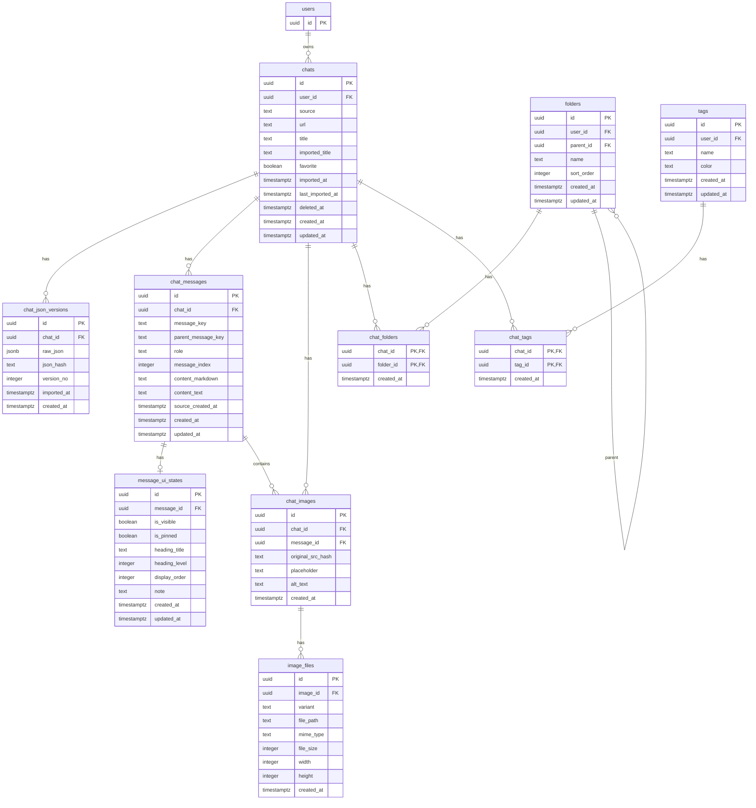

# ChatLogVault DB設計書

## 1. 基本情報

| RDBMS      | データベース名      | 作成日 | 備考                   |
| ---------- | ------------ | --- | -------------------- |
| PostgreSQL | chatlogvault | 未定  | JSON正本・UI状態分離・画像分離構成 |

---

## 2. 設計方針

- 1チャット = 1 JSON
- `source + url` で一意管理
- JSONは正本として保持し、直接変更しない
- UI状態は別テーブルで管理する
- フォルダは階層構造とする
- チャットは複数フォルダに所属可能
- タグ管理を行う
- Base64画像は抽出し、UUIDで管理する
- 画像はオリジナル画像とサムネイル画像を生成・保存する
- チャット本文ではサムネイルを表示し、クリック時にオリジナル画像をモーダル表示する

---

## 3. ER図

---

## 4. テーブル一覧

| No. | 論理テーブル名       | 物理テーブル名              | 区分    | 説明                    |
| --- | ------------- | -------------------- | ----- | --------------------- |
| 1   | チャット          | chats                | table | チャット単位のメタ情報           |
| 2   | チャットJSONバージョン | chat\_json\_versions | table | JSON正本の履歴             |
| 3   | チャットメッセージ     | chat\_messages       | table | JSONから展開した検索・表示用メッセージ |
| 4   | メッセージUI状態     | message\_ui\_states  | table | 表示/非表示、ピン留め、見出し管理     |
| 5   | フォルダ          | folders              | table | 階層フォルダ                |
| 6   | チャットフォルダ関連    | chat\_folders        | table | チャットとフォルダの多対多関連       |
| 7   | タグ            | tags                 | table | タグマスタ                 |
| 8   | チャットタグ関連      | chat\_tags           | table | チャットとタグの多対多関連         |
| 9   | チャット画像        | chat\_images         | table | 画像の論理情報               |
| 10  | 画像ファイル        | image\_files         | table | オリジナル/サムネイル画像ファイル     |

---

# chats（チャット）

## テーブル説明

チャット単位のメタ情報を管理する。

`source + url` により同一チャットを一意に判定する。 再インポート時はこのテーブルを更新し、JSON正本は `chat_json_versions` に保存する。

## テーブル情報

| スキーマ名  | 論理テーブル名 | 物理テーブル名 | 区分    | 備考               |
| ------ | ------- | ------- | ----- | ---------------- |
| public | チャット    | chats   | table | source + url で一意 |

## カラム情報

| No. | 論理名       | 物理名                | データ型        | PK | Not Null | デフォルト               | 備考         |
| --- | --------- | ------------------ | ----------- | -- | -------- | ------------------- | ---------- |
| 1   | ID        | id                 | uuid        | ○  | ○        | gen\_random\_uuid() | 主キー        |
| 2   | ユーザーID    | user\_id           | uuid        |    | ○        |                     | ユーザー参照     |
| 3   | 取得元       | source             | text        |    | ○        |                     | ChatGPT等   |
| 4   | URL       | url                | text        |    | ○        |                     | チャットURL    |
| 5   | タイトル      | title              | text        |    | ○        |                     | 編集可能タイトル   |
| 6   | 取り込み時タイトル | imported\_title    | text        |    |          |                     | 元JSON側タイトル |
| 7   | お気に入り     | favorite           | boolean     |    | ○        | false               | お気に入りフラグ   |
| 8   | 初回取り込み日時  | imported\_at       | timestamptz |    | ○        | now()               |            |
| 9   | 最終取り込み日時  | last\_imported\_at | timestamptz |    | ○        | now()               |            |
| 10  | 削除日時      | deleted\_at        | timestamptz |    |          |                     | 論理削除用      |
| 11  | 作成日時      | created\_at        | timestamptz |    | ○        | now()               |            |
| 12  | 更新日時      | updated\_at        | timestamptz |    | ○        | now()               |            |

## インデックス情報

| No. | インデックス名                 | カラムリスト      |
| --- | ----------------------- | ----------- |
| 1   | idx\_chats\_user\_id    | user\_id    |
| 2   | idx\_chats\_source\_url | source, url |
| 3   | idx\_chats\_deleted\_at | deleted\_at |

## 制約情報

| No. | 制約名                        | 種類          | 制約定義                 |
| --- | -------------------------- | ----------- | -------------------- |
| 1   | chats\_pkey                | PRIMARY KEY | PRIMARY KEY (id)     |
| 2   | chats\_source\_url\_unique | UNIQUE      | UNIQUE (source, url) |

## 外部キー情報

| No. | 外部キー名                 | カラムリスト   | 参照先   | 参照先カラムリスト |
| --- | --------------------- | -------- | ----- | --------- |
| 1   | chats\_user\_id\_fkey | user\_id | users | id        |

---

# chat\_json\_versions（チャットJSONバージョン）

## テーブル説明

JSON正本を保存する。

元JSONは直接変更せず、再インポート時には新しいバージョンとして保存する。

## テーブル情報

| スキーマ名  | 論理テーブル名       | 物理テーブル名              | 区分    | 備考     |
| ------ | ------------- | -------------------- | ----- | ------ |
| public | チャットJSONバージョン | chat\_json\_versions | table | JSON正本 |

## カラム情報

| No. | 論理名      | 物理名          | データ型        | PK | Not Null | デフォルト               | 備考        |
| --- | -------- | ------------ | ----------- | -- | -------- | ------------------- | --------- |
| 1   | ID       | id           | uuid        | ○  | ○        | gen\_random\_uuid() | 主キー       |
| 2   | チャットID   | chat\_id     | uuid        |    | ○        |                     | chats参照   |
| 3   | 正本JSON   | raw\_json    | jsonb       |    | ○        |                     | 取り込み元JSON |
| 4   | JSONハッシュ | json\_hash   | text        |    |          |                     | 差分判定用     |
| 5   | バージョン番号  | version\_no  | integer     |    | ○        | 1                   | チャット内連番   |
| 6   | 取り込み日時   | imported\_at | timestamptz |    | ○        | now()               |           |
| 7   | 作成日時     | created\_at  | timestamptz |    | ○        | now()               |           |

## インデックス情報

| No. | インデックス名                                  | カラムリスト                |
| --- | ---------------------------------------- | --------------------- |
| 1   | idx\_chat\_json\_versions\_chat\_id      | chat\_id              |
| 2   | idx\_chat\_json\_versions\_chat\_version | chat\_id, version\_no |

## 制約情報

| No. | 制約名                                         | 種類          | 制約定義                           |
| --- | ------------------------------------------- | ----------- | ------------------------------ |
| 1   | chat\_json\_versions\_pkey                  | PRIMARY KEY | PRIMARY KEY (id)               |
| 2   | chat\_json\_versions\_chat\_version\_unique | UNIQUE      | UNIQUE (chat\_id, version\_no) |

## 外部キー情報

| No. | 外部キー名                                | カラムリスト   | 参照先   | 参照先カラムリスト |
| --- | ------------------------------------ | -------- | ----- | --------- |
| 1   | chat\_json\_versions\_chat\_id\_fkey | chat\_id | chats | id        |

---

# chat\_messages（チャットメッセージ）

## テーブル説明

JSONから展開したメッセージ情報を保持する。

検索、表示、UI状態管理の対象として利用する派生データであり、JSON正本そのものではない。

## テーブル情報

| スキーマ名  | 論理テーブル名   | 物理テーブル名        | 区分    | 備考     |
| ------ | --------- | -------------- | ----- | ------ |
| public | チャットメッセージ | chat\_messages | table | 検索・表示用 |

## カラム情報

| No. | 論理名        | 物理名                  | データ型        | PK | Not Null | デフォルト               | 備考                         |
| --- | ---------- | -------------------- | ----------- | -- | -------- | ------------------- | -------------------------- |
| 1   | ID         | id                   | uuid        | ○  | ○        | gen\_random\_uuid() | 主キー                        |
| 2   | チャットID     | chat\_id             | uuid        |    | ○        |                     | chats参照                    |
| 3   | メッセージキー    | message\_key         | text        |    | ○        |                     | JSON側ID                    |
| 4   | 親メッセージキー   | parent\_message\_key | text        |    |          |                     | JSON側親ID                   |
| 5   | ロール        | role                 | text        |    | ○        |                     | user / assistant / system等 |
| 6   | メッセージ順     | message\_index       | integer     |    | ○        |                     | 表示順                        |
| 7   | Markdown本文 | content\_markdown    | text        |    |          |                     | 画像はプレースホルダー化               |
| 8   | 検索用本文      | content\_text        | text        |    |          |                     | Markdown除去後テキスト            |
| 9   | 元作成日時      | source\_created\_at  | timestamptz |    |          |                     | JSON側日時                    |
| 10  | 作成日時       | created\_at          | timestamptz |    | ○        | now()               |                            |
| 11  | 更新日時       | updated\_at          | timestamptz |    | ○        | now()               |                            |

## インデックス情報

| No. | インデックス名                            | カラムリスト                                |
| --- | ---------------------------------- | ------------------------------------- |
| 1   | idx\_chat\_messages\_chat\_id      | chat\_id                              |
| 2   | idx\_chat\_messages\_chat\_index   | chat\_id, message\_index              |
| 3   | idx\_chat\_messages\_content\_text | to\_tsvector('simple', content\_text) |

## 制約情報

| No. | 制約名                                        | 種類          | 制約定義                            |
| --- | ------------------------------------------ | ----------- | ------------------------------- |
| 1   | chat\_messages\_pkey                       | PRIMARY KEY | PRIMARY KEY (id)                |
| 2   | chat\_messages\_chat\_message\_key\_unique | UNIQUE      | UNIQUE (chat\_id, message\_key) |

## 外部キー情報

| No. | 外部キー名                          | カラムリスト   | 参照先   | 参照先カラムリスト |
| --- | ------------------------------ | -------- | ----- | --------- |
| 1   | chat\_messages\_chat\_id\_fkey | chat\_id | chats | id        |

---

# message\_ui\_states（メッセージUI状態）

## テーブル説明

メッセージごとのUI状態を管理する。

表示/非表示、ピン留め、見出し設定、メモなど、ユーザーが再構成した情報を保持する。

## テーブル情報

| スキーマ名  | 論理テーブル名   | 物理テーブル名             | 区分    | 備考         |
| ------ | --------- | ------------------- | ----- | ---------- |
| public | メッセージUI状態 | message\_ui\_states | table | JSON正本とは分離 |

## カラム情報

| No. | 論理名     | 物理名            | データ型        | PK | Not Null | デフォルト               | 備考               |
| --- | ------- | -------------- | ----------- | -- | -------- | ------------------- | ---------------- |
| 1   | ID      | id             | uuid        | ○  | ○        | gen\_random\_uuid() | 主キー              |
| 2   | メッセージID | message\_id    | uuid        |    | ○        |                     | chat\_messages参照 |
| 3   | 表示フラグ   | is\_visible    | boolean     |    | ○        | true                | falseで非表示        |
| 4   | ピン留めフラグ | is\_pinned     | boolean     |    | ○        | false               |                  |
| 5   | 見出しタイトル | heading\_title | text        |    |          |                     | TOC表示用           |
| 6   | 見出しレベル  | heading\_level | integer     |    |          |                     | 1〜6              |
| 7   | 表示順     | display\_order | integer     |    |          |                     | 将来の手動並び替え用       |
| 8   | メモ      | note           | text        |    |          |                     | ユーザーメモ           |
| 9   | 作成日時    | created\_at    | timestamptz |    | ○        | now()               |                  |
| 10  | 更新日時    | updated\_at    | timestamptz |    | ○        | now()               |                  |

## インデックス情報

| No. | インデックス名                               | カラムリスト      |
| --- | ------------------------------------- | ----------- |
| 1   | idx\_message\_ui\_states\_message\_id | message\_id |
| 2   | idx\_message\_ui\_states\_pinned      | is\_pinned  |

## 制約情報

| No. | 制約名                                        | 種類          | 制約定義                                                     |
| --- | ------------------------------------------ | ----------- | -------------------------------------------------------- |
| 1   | message\_ui\_states\_pkey                  | PRIMARY KEY | PRIMARY KEY (id)                                         |
| 2   | message\_ui\_states\_message\_unique       | UNIQUE      | UNIQUE (message\_id)                                     |
| 3   | message\_ui\_states\_heading\_level\_check | CHECK       | heading\_level IS NULL OR heading\_level BETWEEN 1 AND 6 |

## 外部キー情報

| No. | 外部キー名                                  | カラムリスト      | 参照先            | 参照先カラムリスト |
| --- | -------------------------------------- | ----------- | -------------- | --------- |
| 1   | message\_ui\_states\_message\_id\_fkey | message\_id | chat\_messages | id        |

---

# folders（フォルダ）

## テーブル説明

チャット整理用の階層フォルダを管理する。

`parent_id` により親子関係を表現する。

## テーブル情報

| スキーマ名  | 論理テーブル名 | 物理テーブル名 | 区分    | 備考   |
| ------ | ------- | ------- | ----- | ---- |
| public | フォルダ    | folders | table | 階層構造 |

## カラム情報

| No. | 論理名     | 物理名         | データ型        | PK | Not Null | デフォルト               | 備考     |
| --- | ------- | ----------- | ----------- | -- | -------- | ------------------- | ------ |
| 1   | ID      | id          | uuid        | ○  | ○        | gen\_random\_uuid() | 主キー    |
| 2   | ユーザーID  | user\_id    | uuid        |    | ○        |                     | ユーザー参照 |
| 3   | 親フォルダID | parent\_id  | uuid        |    |          |                     | 自己参照   |
| 4   | フォルダ名   | name        | text        |    | ○        |                     |        |
| 5   | 並び順     | sort\_order | integer     |    | ○        | 0                   |        |
| 6   | 作成日時    | created\_at | timestamptz |    | ○        | now()               |        |
| 7   | 更新日時    | updated\_at | timestamptz |    | ○        | now()               |        |

## インデックス情報

| No. | インデックス名                  | カラムリスト     |
| --- | ------------------------ | ---------- |
| 1   | idx\_folders\_user\_id   | user\_id   |
| 2   | idx\_folders\_parent\_id | parent\_id |

## 制約情報

| No. | 制約名                                 | 種類          | 制約定義                                |
| --- | ----------------------------------- | ----------- | ----------------------------------- |
| 1   | folders\_pkey                       | PRIMARY KEY | PRIMARY KEY (id)                    |
| 2   | folders\_user\_parent\_name\_unique | UNIQUE      | UNIQUE (user\_id, parent\_id, name) |

## 外部キー情報

| No. | 外部キー名                     | カラムリスト     | 参照先     | 参照先カラムリスト |
| --- | ------------------------- | ---------- | ------- | --------- |
| 1   | folders\_user\_id\_fkey   | user\_id   | users   | id        |
| 2   | folders\_parent\_id\_fkey | parent\_id | folders | id        |

---

# chat\_folders（チャットフォルダ関連）

## テーブル説明

チャットとフォルダの多対多関連を管理する。

1つのチャットを複数フォルダに所属させることができる。

## テーブル情報

| スキーマ名  | 論理テーブル名    | 物理テーブル名       | 区分    | 備考    |
| ------ | ---------- | ------------- | ----- | ----- |
| public | チャットフォルダ関連 | chat\_folders | table | 多対多関連 |

## カラム情報

| No. | 論理名    | 物理名         | データ型        | PK | Not Null | デフォルト | 備考        |
| --- | ------ | ----------- | ----------- | -- | -------- | ----- | --------- |
| 1   | チャットID | chat\_id    | uuid        | ○  | ○        |       | chats参照   |
| 2   | フォルダID | folder\_id  | uuid        | ○  | ○        |       | folders参照 |
| 3   | 作成日時   | created\_at | timestamptz |    | ○        | now() |           |

## インデックス情報

| No. | インデックス名                        | カラムリスト     |
| --- | ------------------------------ | ---------- |
| 1   | idx\_chat\_folders\_folder\_id | folder\_id |

## 制約情報

| No. | 制約名                 | 種類          | 制約定義                               |
| --- | ------------------- | ----------- | ---------------------------------- |
| 1   | chat\_folders\_pkey | PRIMARY KEY | PRIMARY KEY (chat\_id, folder\_id) |

## 外部キー情報

| No. | 外部キー名                           | カラムリスト     | 参照先     | 参照先カラムリスト |
| --- | ------------------------------- | ---------- | ------- | --------- |
| 1   | chat\_folders\_chat\_id\_fkey   | chat\_id   | chats   | id        |
| 2   | chat\_folders\_folder\_id\_fkey | folder\_id | folders | id        |

---

# tags（タグ）

## テーブル説明

チャットに付与するタグを管理する。

## テーブル情報

| スキーマ名  | 論理テーブル名 | 物理テーブル名 | 区分    | 備考    |
| ------ | ------- | ------- | ----- | ----- |
| public | タグ      | tags    | table | タグマスタ |

## カラム情報

| No. | 論理名    | 物理名         | データ型        | PK | Not Null | デフォルト               | 備考     |
| --- | ------ | ----------- | ----------- | -- | -------- | ------------------- | ------ |
| 1   | ID     | id          | uuid        | ○  | ○        | gen\_random\_uuid() | 主キー    |
| 2   | ユーザーID | user\_id    | uuid        |    | ○        |                     | ユーザー参照 |
| 3   | タグ名    | name        | text        |    | ○        |                     |        |
| 4   | 色      | color       | text        |    |          |                     | 表示色    |
| 5   | 作成日時   | created\_at | timestamptz |    | ○        | now()               |        |
| 6   | 更新日時   | updated\_at | timestamptz |    | ○        | now()               |        |

## インデックス情報

| No. | インデックス名             | カラムリスト   |
| --- | ------------------- | -------- |
| 1   | idx\_tags\_user\_id | user\_id |

## 制約情報

| No. | 制約名                      | 種類          | 制約定義                    |
| --- | ------------------------ | ----------- | ----------------------- |
| 1   | tags\_pkey               | PRIMARY KEY | PRIMARY KEY (id)        |
| 2   | tags\_user\_name\_unique | UNIQUE      | UNIQUE (user\_id, name) |

## 外部キー情報

| No. | 外部キー名                | カラムリスト   | 参照先   | 参照先カラムリスト |
| --- | -------------------- | -------- | ----- | --------- |
| 1   | tags\_user\_id\_fkey | user\_id | users | id        |

---

# chat\_tags（チャットタグ関連）

## テーブル説明

チャットとタグの多対多関連を管理する。

## テーブル情報

| スキーマ名  | 論理テーブル名  | 物理テーブル名    | 区分    | 備考    |
| ------ | -------- | ---------- | ----- | ----- |
| public | チャットタグ関連 | chat\_tags | table | 多対多関連 |

## カラム情報

| No. | 論理名    | 物理名         | データ型        | PK | Not Null | デフォルト | 備考      |
| --- | ------ | ----------- | ----------- | -- | -------- | ----- | ------- |
| 1   | チャットID | chat\_id    | uuid        | ○  | ○        |       | chats参照 |
| 2   | タグID   | tag\_id     | uuid        | ○  | ○        |       | tags参照  |
| 3   | 作成日時   | created\_at | timestamptz |    | ○        | now() |         |

## インデックス情報

| No. | インデックス名                  | カラムリスト  |
| --- | ------------------------ | ------- |
| 1   | idx\_chat\_tags\_tag\_id | tag\_id |

## 制約情報

| No. | 制約名              | 種類          | 制約定義                            |
| --- | ---------------- | ----------- | ------------------------------- |
| 1   | chat\_tags\_pkey | PRIMARY KEY | PRIMARY KEY (chat\_id, tag\_id) |

## 外部キー情報

| No. | 外部キー名                      | カラムリスト   | 参照先   | 参照先カラムリスト |
| --- | -------------------------- | -------- | ----- | --------- |
| 1   | chat\_tags\_chat\_id\_fkey | chat\_id | chats | id        |
| 2   | chat\_tags\_tag\_id\_fkey  | tag\_id  | tags  | id        |

---

# chat\_images（チャット画像）

## テーブル説明

チャット内の画像を論理的に管理する。

Base64画像を抽出した単位で1レコード作成する。 Markdown内では `chatlogvault:image:{id}` のプレースホルダーで参照する。

## テーブル情報

| スキーマ名  | 論理テーブル名 | 物理テーブル名      | 区分    | 備考     |
| ------ | ------- | ------------ | ----- | ------ |
| public | チャット画像  | chat\_images | table | 画像メタ情報 |

## カラム情報

| No. | 論理名      | 物理名                 | データ型        | PK | Not Null | デフォルト               | 備考                       |
| --- | -------- | ------------------- | ----------- | -- | -------- | ------------------- | ------------------------ |
| 1   | ID       | id                  | uuid        | ○  | ○        | gen\_random\_uuid() | 画像参照ID                   |
| 2   | チャットID   | chat\_id            | uuid        |    | ○        |                     | chats参照                  |
| 3   | メッセージID  | message\_id         | uuid        |    |          |                     | chat\_messages参照         |
| 4   | 元画像ハッシュ  | original\_src\_hash | text        |    |          |                     | 元Base64画像のハッシュ           |
| 5   | プレースホルダー | placeholder         | text        |    | ○        |                     | chatlogvault\:image:{id} |
| 6   | 代替テキスト   | alt\_text           | text        |    |          |                     | Markdown画像のalt文字         |
| 7   | 作成日時     | created\_at         | timestamptz |    | ○        | now()               |                          |

## インデックス情報

| No. | インデックス名                        | カラムリスト      |
| --- | ------------------------------ | ----------- |
| 1   | idx\_chat\_images\_chat\_id    | chat\_id    |
| 2   | idx\_chat\_images\_message\_id | message\_id |

## 制約情報

| No. | 制約名                               | 種類          | 制約定義                 |
| --- | --------------------------------- | ----------- | -------------------- |
| 1   | chat\_images\_pkey                | PRIMARY KEY | PRIMARY KEY (id)     |
| 2   | chat\_images\_placeholder\_unique | UNIQUE      | UNIQUE (placeholder) |

## 外部キー情報

| No. | 外部キー名                           | カラムリスト      | 参照先            | 参照先カラムリスト |
| --- | ------------------------------- | ----------- | -------------- | --------- |
| 1   | chat\_images\_chat\_id\_fkey    | chat\_id    | chats          | id        |
| 2   | chat\_images\_message\_id\_fkey | message\_id | chat\_messages | id        |

---

# image\_files（画像ファイル）

## テーブル説明

画像ファイルの実体情報を管理する。

1つの画像に対して、オリジナル画像とサムネイル画像を保持する。

## テーブル情報

| スキーマ名  | 論理テーブル名 | 物理テーブル名      | 区分    | 備考                   |
| ------ | ------- | ------------ | ----- | -------------------- |
| public | 画像ファイル  | image\_files | table | original / thumbnail |

## カラム情報

| No. | 論理名     | 物理名         | データ型        | PK | Not Null | デフォルト               | 備考                   |
| --- | ------- | ----------- | ----------- | -- | -------- | ------------------- | -------------------- |
| 1   | ID      | id          | uuid        | ○  | ○        | gen\_random\_uuid() | 主キー                  |
| 2   | 画像ID    | image\_id   | uuid        |    | ○        |                     | chat\_images参照       |
| 3   | 種別      | variant     | text        |    | ○        |                     | original / thumbnail |
| 4   | ファイルパス  | file\_path  | text        |    | ○        |                     | 保存先パス                |
| 5   | MIMEタイプ | mime\_type  | text        |    | ○        |                     | image/png等           |
| 6   | ファイルサイズ | file\_size  | integer     |    |          |                     | byte                 |
| 7   | 幅       | width       | integer     |    |          |                     | px                   |
| 8   | 高さ      | height      | integer     |    |          |                     | px                   |
| 9   | 作成日時    | created\_at | timestamptz |    | ○        | now()               |                      |

## インデックス情報

| No. | インデックス名                      | カラムリスト    |
| --- | ---------------------------- | --------- |
| 1   | idx\_image\_files\_image\_id | image\_id |

## 制約情報

| No. | 制約名                                  | 種類          | 制約定義                                 |
| --- | ------------------------------------ | ----------- | ------------------------------------ |
| 1   | image\_files\_pkey                   | PRIMARY KEY | PRIMARY KEY (id)                     |
| 2   | image\_files\_image\_variant\_unique | UNIQUE      | UNIQUE (image\_id, variant)          |
| 3   | image\_files\_variant\_check         | CHECK       | variant IN ('original', 'thumbnail') |

## 外部キー情報

| No. | 外部キー名                         | カラムリスト    | 参照先          | 参照先カラムリスト |
| --- | ----------------------------- | --------- | ------------ | --------- |
| 1   | image\_files\_image\_id\_fkey | image\_id | chat\_images | id        |

---

## 5. 補足

### JSON正本

`chat_json_versions.raw_json` を正本とし、アプリ側で直接変更しない。

検索・表示・UI制御のために `chat_messages` へ展開する。

### UI状態分離

非表示、ピン留め、見出し、メモは `message_ui_states` で管理する。

これにより、再インポート時にもユーザーが編集したUI状態を保持しやすくする。

### 画像管理

Base64画像は取り込み時に抽出し、ファイルシステムへ保存する。

DBでは `chat_images` が論理画像を表し、`image_files` が実ファイルを表す。

本文表示ではサムネイルを利用し、モーダル表示時のみオリジナル画像を読み込む。

